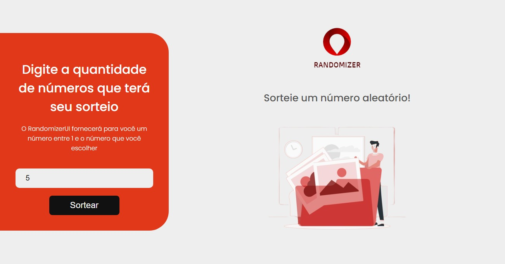

[PROJECT__BADGE]: https://img.shields.io/badge/📱Visit_this_project-000?style=for-the-badge&logo=project
[PROJECT__URL]: https://randomizer-ui.vercel.app

  
    

# RandomizerUI

A simple and efficient random number generator website. The user chooses the quantity of numbers they want in the draw, and the site will randomly select a number from them. It works seamlessly on both desktop and mobile devices.

[![project][PROJECT__BADGE]][PROJECT__URL]

## Tech Stack

<!--- # "Verify icons availability here https://github.com/tandpfun/skill-icons" -->

## Contribute

1. **Clone project**: `git clone https://github.com/RodriguesGS/RandomizerUI.git`
2. **Create feature/branch**: `git checkout -b feature/NAME`