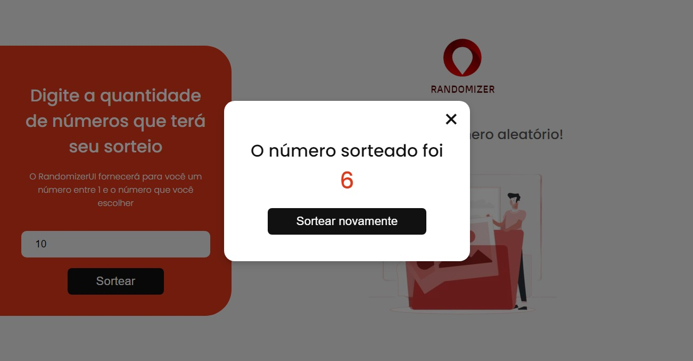

[JAVASCRIPT__BADGE]: https://img.shields.io/badge/Javascript-000?style=for-the-badge&logo=javascript
[PROJECT__BADGE]: https://img.shields.io/badge/📱Visit_this_project-000?style=for-the-badge&logo=project
[PROJECT__URL]: https://randomizer-ui.vercel.app

<h1 align="center" style="font-weight: bold;">RandomizerUI 😎</h1>

![javascript][JAVASCRIPT__BADGE]

<p align="center">
 <a href="#about">About</a> • 
 <a href="#started">Getting Started</a> • 
  <a href="#started">App Routes</a> • 
  <a href="#colab">Collaborators</a> •
 <a href="#contribute">Contribute</a>
</p>


<p align="center">
    
    
</p>

<h2 id="started">📌 About</h2>

A simple and efficient random number generator website. The user chooses the quantity of numbers they want in the draw, and the site will randomly select a number from them. It works seamlessly on both desktop and mobile devices.

[![project][PROJECT__BADGE]][PROJECT__URL]

<h2 id="started">🚀 Getting started</h2>

<h3>Cloning</h3>

How to clone your project

```bash
git clone https://github.com/RodriguesGS/RandomizerUI.git
Open index.html
```
